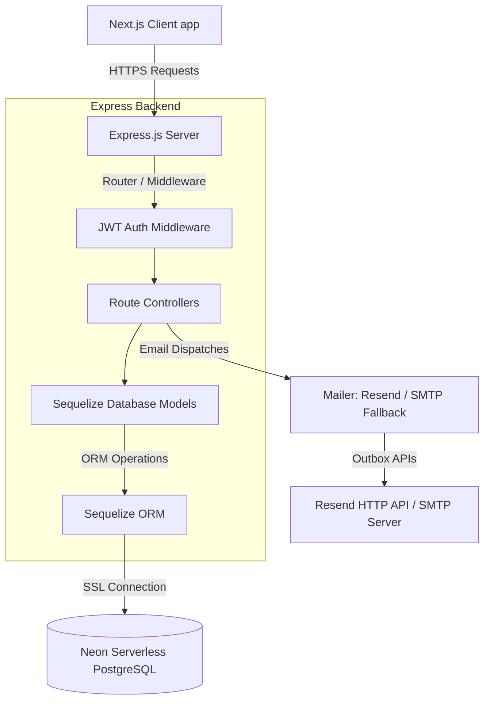

# 🏢 Odoo Forge HRMS

```text
    ┌────────────────────────┐        ┌────────────────────────┐
    │     Next.js Client     │ ──────>│   Express API Server   │
    │     (Port 3000)        │ <──────│   (Port 5000)          │
    └────────────────────────┘        └───────────┬────────────┘
                                                  │
                                                  ▼
                                      ┌────────────────────────┐
                                      │     Sequelize ORM      │
                                      └───────────┬────────────┘
                                                  │ (SSL Connect)
                                                  ▼
                                      ┌────────────────────────┐
                                      │   Neon PostgreSQL DB   │
                                      │   (Serverless Cloud)   │
                                      └────────────────────────┘
```

Odoo Forge HRMS is a state-of-the-art, premium Human Resource Management System (HRMS) designed to digitize, automate, and streamline core organizational workflows. Built with a modern **Next.js** frontend and a high-performance **Express/Node.js** backend, the system leverages **PostgreSQL (hosted on Neon DB)** and **Sequelize ORM** for its relational database layer.

The system enables automated employee onboarding, dynamic salary calculations, automatic attendance monitoring (with check-in, check-out, and overtime calculations), and a robust multi-role approval workflow for leaves and time-off requests.

---

## ⚡ Tech Stack & Tools

### Frontend
* **Core Framework:** [Next.js 14+](https://nextjs.org/) (App Router & React Server Components)
* **Styling & Theme:** [Tailwind CSS](https://tailwindcss.com/) with a sleek, responsive dark mode and custom dashboard cards
* **State Management:** [Zustand](https://github.com/pmndrs/zustand) (Lightweight, decoupled state manager)
* **Icons:** [Lucide React](https://lucide.dev/)
* **HTTP Client:** [Axios](https://axios-http.com/)

### Backend
* **Runtime:** [Node.js](https://nodejs.org/) & [Express.js](https://expressjs.com/)
* **Database & ORM:** PostgreSQL hosted on [Neon](https://neon.tech/) and managed through [Sequelize ORM](https://sequelize.org/)
* **Auth & Security:** [JSON Web Tokens (JWT)](https://jwt.io/) & [BcryptJS](https://www.npmjs.com/package/bcryptjs)
* **Email Delivery:** [Resend API](https://resend.com/) with automatic fallback to **Nodemailer SMTP**
* **File Processing:** [Multer](https://github.com/expressjs/multer) (for file buffers and local processing)

---

## 🏗️ Project Architecture



### Monorepo Structure
```text
  OdooXadamas/
  ├── frontend/                 # Client Codebase (Next.js)
  │   ├── app/                  # Layouts, Auth views, Employee Dashboards
  │   ├── components/           # Reusable UI widgets & Forms
  │   └── public/               # Default static assets and logos
  │
  ├── Backend/                  # API Server Codebase (Node/Express)
  │   ├── src/
  │   │   ├── config/           # Database configurations (db.js, sequelize.js)
  │   │   ├── controllers/      # Route controllers (Auth, Employees, Attendance)
  │   │   ├── models/           # Sequelize model entities (Employee, Org, TimeOff)
  │   │   ├── middlewares/      # Security, JWT validations, Multer configs
  │   │   └── utils/            # Mail dispatches, unique ID generator
  │   │
  │   ├── public/               # HTML documentation & Tester client
  │   └── scratch/              # Database maintenance scripts
  │
  └── README.md                 # Primary system manual
```

---

## 🗄️ Database Architecture

The application uses **PostgreSQL** hosted on **Neon DB** as its relational database. The schema structure consists of 6 core tables:

### 1. Organizations (`organizations`)
Stores the main company information.
* `_id` (VARCHAR(24), Primary Key)
* `name` (VARCHAR(255), Unique)
* `logo` (TEXT)
* `phone` (VARCHAR(255))
* `createdAt` (TIMESTAMP)

### 2. Employees (`employees`)
Stores employee records, credential hashes, and personal/professional details.
* `_id` (VARCHAR(24), Primary Key)
* `employee_id` (VARCHAR(255), Unique) — Auto-generated via specialized logic
* `name` (VARCHAR(255))
* `email` (VARCHAR(255), Unique)
* `mobile` (VARCHAR(255))
* `company_id` (VARCHAR(24), Foreign Key → `organizations`)
* `department` (VARCHAR(255))
* `manager_id` (VARCHAR(24), Foreign Key → `employees`, Self-referential)
* `location` (VARCHAR(255))
* `status` (VARCHAR(255)) — `Present` / `Absent` / `On Leave`
* `password_hash` (VARCHAR(255))
* `role` (VARCHAR(255)) — `Admin` / `HR` / `Employee`
* `isVerified` (BOOLEAN)
* `isActivated` (BOOLEAN)
* `profilePicture` (TEXT) — Stores raw Base64 data strings
* `date_of_birth` (TIMESTAMP)
* `nationality` (VARCHAR(255))
* `marital_status` (VARCHAR(255))
* `gender` (VARCHAR(255))
* `resume` (JSONB) — Stores bio, interests, and professional history
* `skills` (ARRAY(TEXT))
* `certifications` (ARRAY(TEXT))

### 3. Attendances (`attendances`)
Daily work hours logs for employees.
* `_id` (VARCHAR(24), Primary Key)
* `employee_id` (VARCHAR(24), Foreign Key → `employees`)
* `date` (VARCHAR(10)) — Format `YYYY-MM-DD`
* `check_in` (TIMESTAMP)
* `check_out` (TIMESTAMP, Nullable)
* `work_hours` (FLOAT)
* `extra_hours` (FLOAT)

### 4. Time Off Requests (`time_off_requests`)
Leave requests submitted by employees.
* `_id` (VARCHAR(24), Primary Key)
* `employee_id` (VARCHAR(24), Foreign Key → `employees`)
* `time_off_type` (VARCHAR(255)) — `Paid Time off` / `Sick Leave`
* `start_date` (TIMESTAMP)
* `end_date` (TIMESTAMP)
* `allocation_days` (INTEGER)
* `remarks` (TEXT)
* `attachment_url` (TEXT) — Stores uploaded medical certificate paths or links
* `status` (VARCHAR(255)) — `Pending` / `Approved` / `Rejected`
* `comments` (TEXT) — Reviewer remarks

### 5. Time Off Allocations (`time_off_allocations`)
Current leave balances per employee.
* `_id` (VARCHAR(24), Primary Key)
* `employee_id` (VARCHAR(24), Foreign Key → `employees`, Unique)
* `paid_time_off_available` (INTEGER) — Default 24 days
* `sick_time_off_available` (INTEGER) — Default 7 days

### 6. Salary Settings (`salary_settings`)
Configures payroll, deductions, and allowances.
* `_id` (VARCHAR(24), Primary Key)
* `employee_id` (VARCHAR(24), Foreign Key → `employees`, Unique)
* `monthly_wage` (FLOAT)
* `yearly_wage` (FLOAT)
* `working_days_per_week` (INTEGER)
* `break_time_hours` (FLOAT)
* `basic_salary` (FLOAT) — Auto-calculated (50% of monthly wage)
* `hra` (FLOAT) — Auto-calculated (50% of basic)
* `standard_allowance` (FLOAT) — Auto-calculated
* `performance_bonus` (FLOAT) — Auto-calculated
* `lta` (FLOAT) — Auto-calculated
* `fixed_allowance` (FLOAT) — Auto-calculated
* `employee_pf` (FLOAT) — Auto-calculated
* `employer_pf` (FLOAT) — Auto-calculated
* `professional_tax` (FLOAT)

---

## ⚙️ Special Application Logics & Architecture

Several custom architectural elements were developed to ensure the system is robust and secure:

### 1. Globally Unique Employee ID Generation (`idGenerator.js`)
Employee ID generation follows a strict corporate format:
`[Company Initials (2 letters)][Name Initials (2-4 letters)][Year of Joining][4-digit Serial Number]`
* **Example:** `OISHHA20260002` (Company: **O**doo **I**ndia, Name: **Sh**ovon **Ha**lder, Year: **2026**, Serial: **0002**).
* **Collision Protection Loop:** To prevent global collision errors across organizations, the generator queries the database in a loop, checking the availability of the ID and incrementing the serial count automatically if a conflict is detected.

### 2. In-place Mutation Tracking
Sequelize does not automatically detect array updates (such as `.push()` on skills/certifications arrays) or JSON additions because the object references do not change. We overrode the `.save()` method to automatically call `this.changed(key, true)` for array and JSONB columns, ensuring changes are always written to PostgreSQL.

### 3. Dual-Protocol Mailer with Failover (`mailer.js`)
Because hosting platforms (like Render Free Tier) block standard SMTP traffic on ports 25, 465, and 587, we configured the mailer to dispatch verification and onboarding emails via the **Resend HTTP API**. In case the Resend account limit or validation errors trigger a failure, it automatically falls back to standard **Nodemailer SMTP** as a safety net.

---

## 🔑 Login & Testing Credentials

Use the following mock credentials to log in and test role features:

| User Role | Login Email / ID | Password | Purpose / Features |
|---|---|---|---|
| **Admin / HR Officer** | `OISHHA20260001` | `@Odoo123456` | Can onboard employees, approve/reject leaves, modify salary structures, and view directory attendance |
| **Employee** | `OIRARO20260002` | `Tmp2f2fc3!` | Can check-in/out, apply for leaves, view salary breakdown, and update profile skills/avatar |

---

## 📧 Automated Emails Screenshots

Below are placeholders for the transactional emails generated by the HRMS portal (such as registration notifications, account verification, and employee credentials dispatches):

### 1. Org Admin Welcome & Setup Email


### 2. Employee Account Activation Email


---


## 🚀 Getting Started Locally

Follow this comprehensive guide to configure, initialize, and run the Odoo Forge HRMS application on your local machine.

### 📋 Prerequisites
Ensure you have the following installed before starting:
* **Node.js** (v18.x or higher)
* **npm** (v9.x or higher) or **yarn**
* **PostgreSQL Database** (Either a local PostgreSQL instance or a serverless instance on [Neon DB](https://neon.tech/))

---

### 📂 Step 1: Backend Setup & Configuration

1. **Navigate to the Backend directory:**
   ```bash
   cd Backend
   ```

2. **Install Dependencies:**
   ```bash
   npm install
   ```

3. **Configure Environment Variables:**
   Create a `.env` file in the `Backend/` directory and populate it with the following configuration:
   ```env
   # Server Config
   PORT=5000
   NODE_ENV=development

   # Database Connection (PostgreSQL connection string)
   # If using Neon, make sure to append ?sslmode=require at the end
   DATABASE_URL=postgresql://neondb_owner:[PASSWORD]@[HOST]/neondb?sslmode=require

   # Authentication Security Key
   JWT_SECRET=your_jwt_signing_secret_key_here

   # Email Dispatcher Settings
   # Provide your Resend API token. 
   # Note: For free Resend sandbox accounts, you can only send verification emails to your registered email address.
   RESEND_API_KEY=re_your_resend_api_token
   
   # Custom domain email sender address. Must match your verified domain on Resend.
   MAIL_FROM=HRMS Portal <no-reply@shovon.tech>

   # SMTP Fallback Configurations (Used automatically if Resend fails)
   SMTP_HOST=smtp.gmail.com
   SMTP_PORT=587
   SMTP_USER=your_gmail_address@gmail.com
   SMTP_PASS=your_gmail_app_password

   # Frontend Client URL (for CORS validation)
   FRONTEND_URL=http://localhost:3000
   ```

4. **Initialize Database Tables:**
   The backend uses Sequelize's `{ alter: true }` synchronization schema. On the first boot, the system will automatically create all tables, relationships, and basic indexes in your database.

5. **Start Development Server:**
   ```bash
   npm run dev
   ```
   * The backend API server will start on `http://localhost:5000`.
   * You can access the **Interactive API Client & Tester Console** directly by opening `http://localhost:5000` in your web browser.

---

### 💻 Step 2: Frontend Setup & Configuration

1. **Navigate to the Frontend directory:**
   ```bash
   # From root directory
   cd frontend
   ```

2. **Install Dependencies:**
   ```bash
   npm install
   ```

3. **Configure Environment Variables:**
   Create a `.env.local` file in the `frontend/` directory to configure the Next.js API client endpoint:
   ```env
   # API endpoint pointing to your local Express server
   NEXT_PUBLIC_API_URL=http://localhost:5000/api/v1
   ```

4. **Start Dev Server:**
   ```bash
   npm run dev
   ```
   * The Next.js client app will launch at `http://localhost:3000`.

---

### 🔧 Troubleshooting & Utilities

#### 1. Unique Constraint Violations / Index Bloat
If you restart the server frequently with Sequelize's `alter: true`, duplicate constraint configurations might accumulate under PostgreSQL (e.g. `employees_employee_id_key1`). To clean them up without dropping your tables:
* Run the pre-configured migration script in the Backend folder:
  ```bash
  node scratch/cleanup_indexes.js
  ```

#### 2. Base64 Upload Size Limits
If you get `value too long for type character varying(255)` errors on profile picture uploads, make sure your backend schema has been updated to `DataTypes.TEXT` (our current codebase is fully updated to support this).

#### 3. Mail Client Blocks on Render
When deploying the Backend server to Render, outbound traffic on standard SMTP ports (25, 465, 587) is blocked on Free tier accounts. **Always** specify `RESEND_API_KEY` on Render to route email requests through the HTTP API instead of raw SMTP ports.
